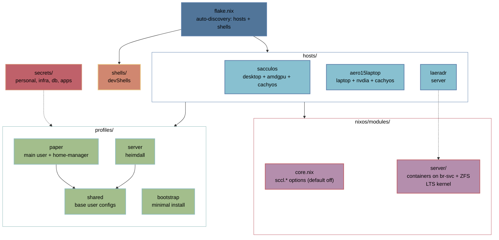

# sccl_nix

nixos config for my homelab - a small desk/server fleet managed from one
flake: flakes + home-manager + disko + sops-nix.
modular host-profile architecture w/ sccl.* options - scale across machines & users


- central repo: [git.sccl.cc/scclie/sccl_nix](https://git.sccl.cc/scclie/sccl_nix)
  (Forgejo on laeradr), mirrored to [Codeberg](https://codeberg.org/scclie/sccl_nix).
- each host is a directory under `hosts/<name>` with a `configuration.nix`;
  the flake auto-discovers hosts and devShells.
- features self-gate via `sccl.*` options (`false` by default)6

## hosts

| docs | host | type | role |
|---|---|---|---|
| [doc/hosts/laeradr.md](doc/hosts/laeradr.md) · [BIOS/WOL](doc/hosts/laeradr-bios.md) | `laeradr` | SFF AM4 server | home server: git, files, pass, mail, monitoring  |
| [doc/hosts/sacculos.md](doc/hosts/sacculos.md) | `sacculos` | desktop AM4 PC | main workstation |
| [doc/hosts/aero15laptop.md](doc/hosts/aero15laptop.md) | `aero15laptop` | laptop | portable |

infra notes: [home router](doc/router.md).

## architecture



- `flake.nix` - minimal logic: `mkHost` + auto-discovery of `hosts/` and `shells/`.
- `nixos/modules/core.nix` - declares every `sccl.*` option (default `false`)
  and imports the feature modules.
- `nixos/modules/<feature>.nix` - each module activates only when
  `sccl.<feature>.enable = true` is set in the host config.
- `nixos/modules/server/` - the headless server stack; services run in ephemeral
  NixOS containers on a private bridge (`br-svc`, `10.69.0.0/24`) with data on
  ZFS `tank` (see `lib.nix` → `mkServiceContainer`).
- `hosts/<name>/` - declares *what* the machine needs: `sccl.{...}`, hardware,
  disko layout, local packages, profiles.
- `profiles/` - user configs (home-manager): `paper`, `server` (heimdall),
  `shared` (base), `bootstrap` (minimal ~1–2 GB installs).
- `secrets/` - sops-nix files split into scopes (`personal`, `infra`, `db`,
  `apps`); a host enables only the scopes it needs.

## features

**system (nixos/modules/):** `core` (options), `ui` (niri/stylix), `audio`,
`bluetooth`, `net`, `secrets` (sops-nix), `mihomo` (TUN proxy), `zapret`
(DPI bypass), `automount`, `playground` (Docker), `nix-ld`, `keyboard`,
`boot`, `nix`, `env`, `stylix`, `timezone`, `xdg-portal`.

**server (nixos/modules/server/, `sccl.server.enable`):** `base` (ssh, fail2ban,
WOL), `dns` (PowerDNS + Unbound + Cloudflare sync), `proxy` (nginx + ACME
wildcard), `databases` (PostgreSQL + Redis), `forgejo` (+ OCI registry),
`sftpgo`, `vaultwarden`, `mail` (stalwart-mail), `monitoring` (Prometheus /
Grafana / Loki / Alertmanager), `status` (Gatus), `backup` (sanoid + restic),
`wireguard`.

sccl.* options expml:

```nix
# hosts/sacculos/configuration.nix
sccl = {
  ui.enable = true;
  audio.enable = true;
  mihomo.enable = true;
  secrets.enable = true;
  playground.enable = true;
  nix-ld.enable = true;
};
```

```nix
# hosts/laeradr/configuration.nix
sccl = {
  server.enable = true;
  dns.enable = true;
  wireguard.enable = true;
  sftpgo.enable = true;
  forgejo.enable = true;
  vaultwarden.enable = true;
  mail.enable = true;
  monitoring.enable = true;
  backup.enable = true;
};
```

## secrets

sops-nix; per-host scopes:
`secrets/personal.yaml` (desktops), `secrets/infra.yaml`,
`secrets/db.yaml`, `secrets/apps.yaml` (laeradr). Encrypted with age keys -
safe for the public repo. Setup: `docs/secrets-setup.md`.

## quick start

```bash
# fresh install from a live ISO
nixos-install --flake .#<hostname>

# normal rebuild
sudo nixos-rebuild switch --flake .#<hostname>

# remote rebuild (target needs your SSH key, e.g. laeradr)
sudo nixos-rebuild switch --flake .#laeradr --target-host root@192.168.0.10

# nixosanywhere
nix run github:nix-community/nixos-anywhere -- \
  --generate-hardware-config nixos-generate-config \
    hosts/<hostname>/hardware-configuration.nix \
  --flake .#<hostname> \
  root@<target-ip>
```

Adding a host: `mkdir hosts/<name>` - copy an existing one,
adjust hostname, `disko.nix`, and `sccl.{...}` flags. The flake picks it up
automatically.

## inspiration

- https://gitlab.com/Zaney/zaneyos - sccl.* options
- https://lgug2z.com/articles/handling-secrets-in-nixos-an-overview/ - sops-nix
  secrets overview that shaped the `secrets/` scoping.

## think about

- https://linux-audit.com/systemd/how-to-harden-a-systemd-service-unit/

## license
MIT
Personal config - use at your own risk. Fork / yoink whatever is useful.
