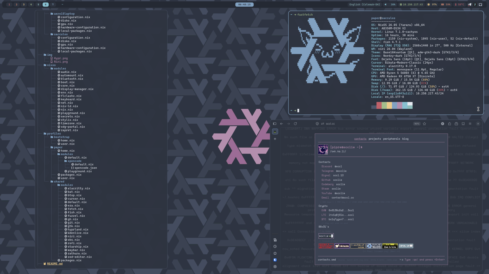

# sccl_nix

overengineered nixos shit-config for my homelab. flakes + home-manager + disko + sops-nix.



- repo: [git.sccl.cc/scclie/sccl_nix](https://git.sccl.cc/scclie/sccl_nix),
  mirrored to [Codeberg](https://codeberg.org/scclie/sccl_nix)
- `hosts/<name>/` - machine layer: `sccl.{...}`, hardware, disko, packages, profiles
- `nixos/modules/` - system modules layer + `nixos/modules/server/`
- `profiles/` - home-manager layer
- `secrets/` - scopes sops-nix
- `doc/` - infra notes

the flake auto-discovers hosts and devShells.
self-gate features

## hosts

| docs | host | type | role |
|---|---|---|---|
| [doc/hosts/laeradr.md](doc/hosts/laeradr.md) · [BIOS/WOL](doc/hosts/laeradr-bios.md) | `laeradr` | SFF AM4 server | git, files, pass, mail, monitoring, all my shi... |
| [doc/hosts/sacculos.md](doc/hosts/sacculos.md) | `sacculos` | desktop AM4 PC | main workstation |
| [doc/hosts/aero15laptop.md](doc/hosts/aero15laptop.md) | `aero15laptop` | 15.6" laptop | portable |
| [doc/router.md](doc/router.md) | - | router | routing :D |


## options
all features(modules), etc. r optional for the profiles, they configured as `sccl.*`
```nix
# hosts/laeradr/configuration.nix
sccl = {
  server.enable = true;
  dns.enable = true;
  mail.enable = true;
  monitoring.enable = true;
  backup.enable = true;
};
```

## inspiration

- https://gitlab.com/Zaney/zaneyos - sccl.* options
- https://lgug2z.com/articles/handling-secrets-in-nixos-an-overview/ - sops-nix secrets overview that shaped the secrets/ scoping.

## thinking about

- https://linux-audit.com/systemd/how-to-harden-a-systemd-service-unit/

## license

MIT
yoink whatever is useful
use at your own risk
